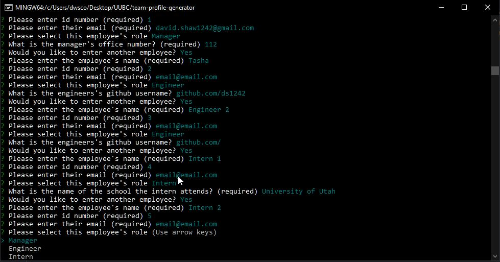
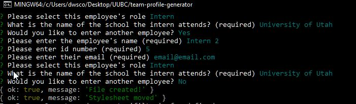
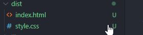
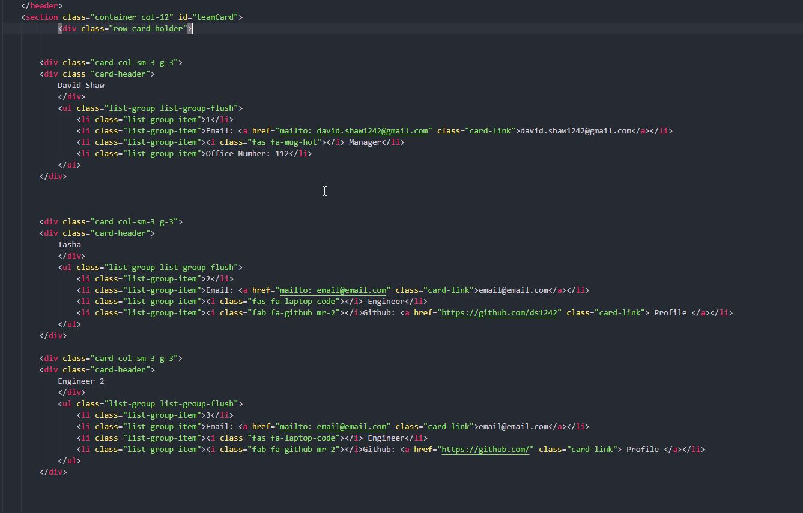
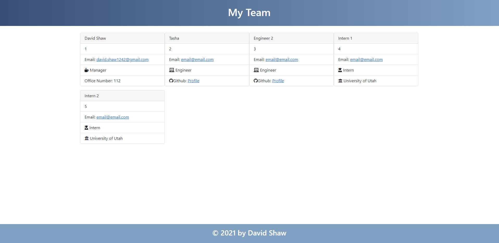

  # Team Profile Generator 

  ## About/Description

  This project uses Inqurirer to take in input from users about a team of employees.  There are three types of employees that can be added, a Manager, an Engineer, and an Intern.  It also asks for the employee id and email.  There are questions specific to each role such as an Engineer will only be asked to add their github or a Manager must add their office number.  Once the user has completed their input, it will then add this information to an array that creates an index.html page with cards for each employee and displays their infomration.  This project also has several tests as it was built using test driven development to check each object created.  

  ## Table of Contents

  * [Installation](#installation)
  * [Usage](#usage)
  * [Languages](#languages)
  * [Contributing](#contributing)
  * [License](#license)
  * [Tests](#tests)
  * [Questions](#questions)
  
  ## Installation

  User must have Node.js to execute the Inqurier from Bash

  ## Usage

  Video Link of Application in Use:
  

  #### Screenshots 

  ##### User Input in Bash

   

  ##### Messages In Bash Showing Page Creation

    

  ##### Output Files Generated in Dist Folder

   

  ##### HTML File Displaying the Cards Created 
  
   

  ##### Page Generated When Opened in Broswer

   

  ## Languages

  JavaScript HTML CSS ES6 Bootstrap Node.js Inqurier Jest

  ## Contributing

  Contributions by: David Shaw

  If you would like to contribute to this project we follow the [Contributor Covenant](https://www.contributor-covenant.org/)

  ## License

  https://choosealicense.com/licenses/mit/

  ## Tests

  Tests were created for the Employee object and then the three extensions for the types of employees taken in from user.

  ## Questions:

  If you have any questions please contact us or refer to our github below:

  Email Us At: david.shaw1242@gmail.com

  Github Repo: https://github.com/ds1242/team-profile-generator

